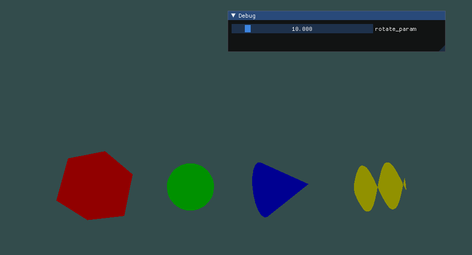
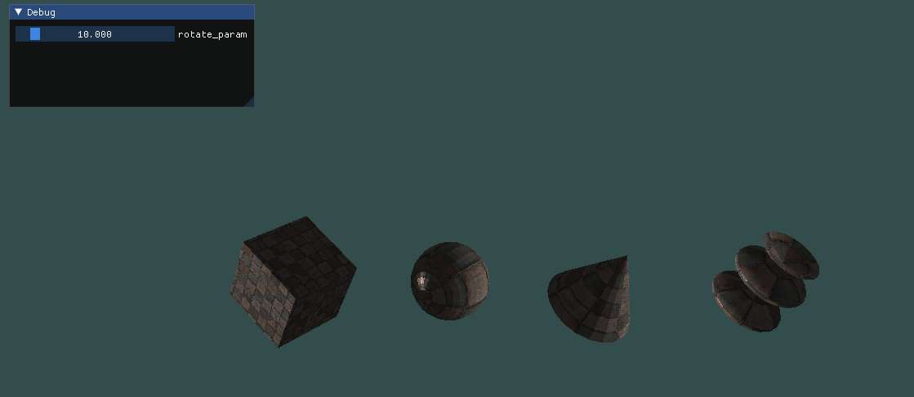
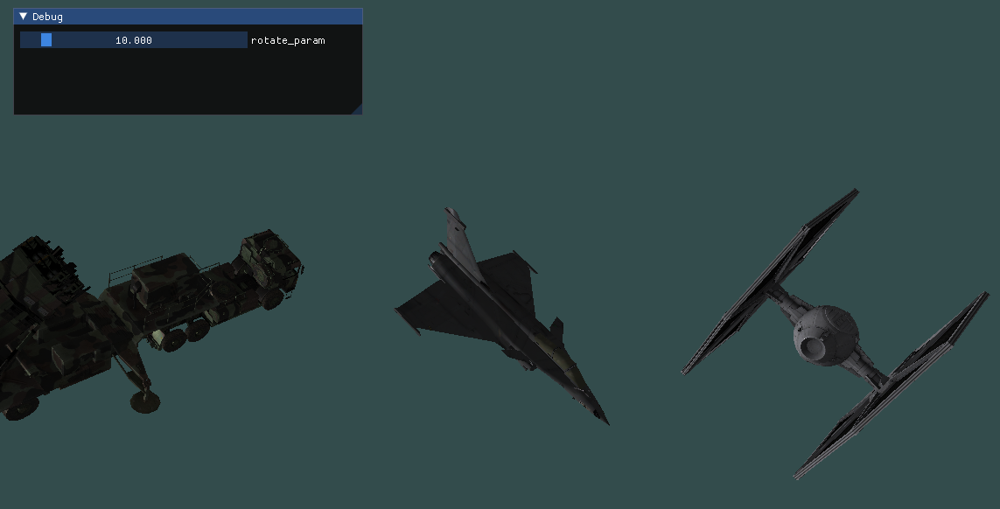

# Demo Projects of [Ez3DGL](https://github.com/MrAMS/Ez3DGL)

## Usage

On Linux:

```shell
cd model_demo
make init
make run
```

## Demos

### vertices_demo

basic usage of vertices_t



### lights_demo

add lights to scene



### model_demo

render OBJ model


